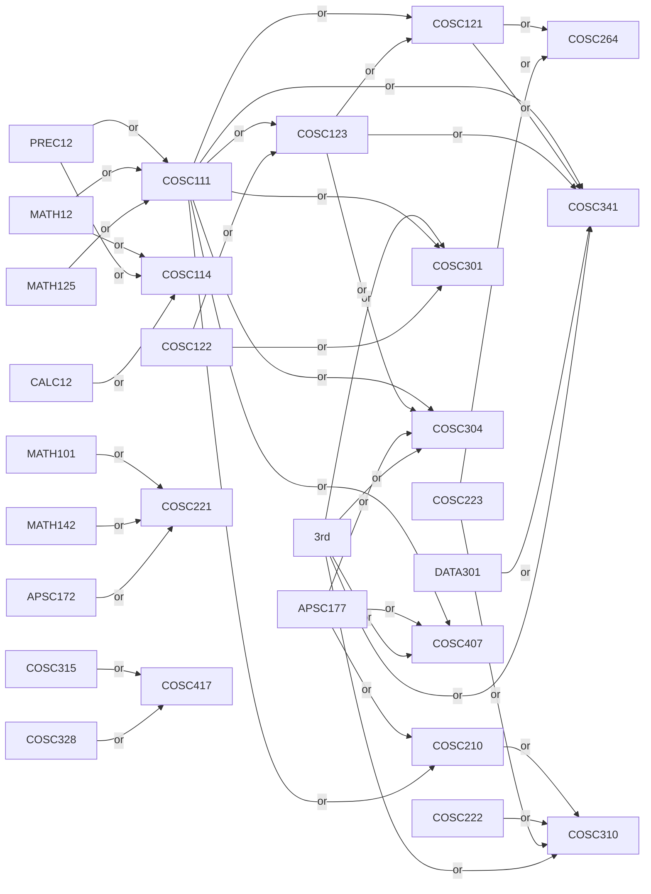

# bchacks2020

```mermaid
graph LR
PREC12--"or"-->COSC111
MATH12--"or"-->COSC111
MATH125--"or"-->COSC111
MATH12--"or"-->COSC114
PREC12--"or"-->COSC114
CALC12--"or"-->COSC114
COSC111--"or"-->COSC121
COSC123--"or"-->COSC121
COSC111--"or"-->COSC123
COSC122--"or"-->COSC123
APSC177--"or"-->COSC210
COSC111--"or"-->COSC210
MATH101--"or"-->COSC221
MATH142--"or"-->COSC221
APSC172--"or"-->COSC221
COSC121--"or"-->COSC264
COSC223--"or"-->COSC264
3rd--"or"-->COSC301
COSC111--"or"-->COSC301
COSC122--"or"-->COSC301
COSC111--"or"-->COSC304
COSC123--"or"-->COSC304
APSC177--"or"-->COSC304
3rd--"or"-->COSC304
COSC210--"or"-->COSC310
COSC222--"or"-->COSC310
COSC223--"or"-->COSC310
3rd--"or"-->COSC310
COSC111--"or"-->COSC341
COSC121--"or"-->COSC341
COSC123--"or"-->COSC341
DATA301--"or"-->COSC341
3rd--"or"-->COSC341
COSC111--"or"-->COSC407
APSC177--"or"-->COSC407
3rd--"or"-->COSC407
COSC315--"or"-->COSC417
COSC328--"or"-->COSC417
```
